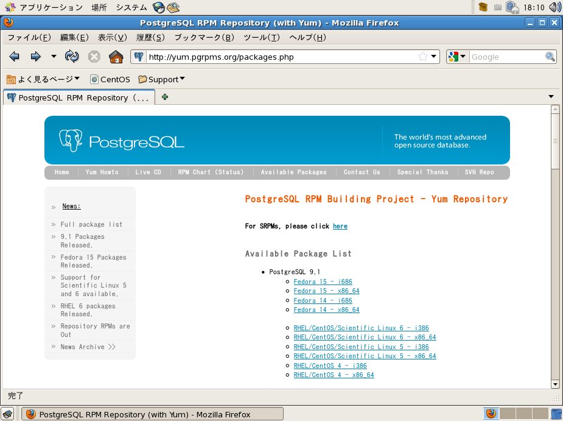

# 実習環境の構築方法
第1章では実習環境を構築するために、PostgreSQLのインストールと、実習で使用するデータベースを作成します。

## OSユーザーの作成
RPMパッケージでPostgreSQLをインストールすると、OSでpostgresユーザーが作成され、関連するディレクトリの所有権やアクセス権が設定されます。このpostgresユーザーをあらかじめ作成しておくことで、OSユーザーとしての設定（ホームディレクトリや環境変数など）の管理がしやすくなりますので本書ではそのように進めます。

以下ではadminユーザーでログイン後、useraddコマンドでpostgresユーザーを作成し、passwdコマンドでユーザーのパスワードを設定しています。その後、suコマンドでpostgresユーザーに切り替えてプロンプトの表示やホームディレクトリ位置を確認し、adminユーザーに戻しています。

[admin@host1 ~]$ sudo useradd postgres
[sudo] admin のパスワード: ※adminユーザーのパスワードを入力
[admin@host1 ~]$ sudo passwd postgres
ユーザー postgres のパスワードを変更。
ユーザー postgres のパスワードを変更。
新しい パスワード:
新しい パスワードを再入力してください:
passwd: すべての認証トークンが正しく更新できました。
[admin@host1 ~]$ su - postgres
パスワード: ※設定したpostgresユーザーのパスワードを入力
最終ログイン: 2024/04/06 (土) 13:49:14 JST 日時 pts/1
[postgres@host1 ~]$ pwd
/home/postgres
[postgres@host1 ~]$ exit
[admin@host1 ~]$

## PostgreSQLのインストール
AlmaLinux 9.3では、ディストリビューションの標準パッケージとしてPostgreSQL 13が提供されています。このパッケージをdnfコマンドを使ってインストールします。

dnfコマンドの引数に必要なパッケージとしてpostgresql-serverを指定してインストールします。依存関係が解消されて、postgresqlパッケージとpostgresql-private-libsパッケージも一緒にインストールされます。

| パッケージ名 | 説明
| --------------------- | -------------------------------------------------------
| postgresql | PostgreSQLを利用する上で必須のクライアントプログラムやライブラリ
| postgresql-private-libs | PostgreSQLを利用する上で必須の共有ライブラリ
| postgresql10-server | サーバープログラムの本体
| postgresql10-contrib | 拡張機能（インストールは必須ではありません）

[admin@host1 ~]$ sudo dnf install postgresql-server
メタデータの期限切れの最終確認: 3:20:56 前の 2024年04月06日 11時06分42秒 に実施しました。
依存関係が解決しました。
================================================================================
 パッケージ                  Arch        バージョン         リポジトリー  サイズ
================================================================================
インストール:
 postgresql-server           aarch64     13.14-1.el9_3      appstream     5.6 M
依存関係のインストール:
 postgresql                  aarch64     13.14-1.el9_3      appstream     1.5 M
 postgresql-private-libs     aarch64     13.14-1.el9_3      appstream     130 k

トランザクションの概要
================================================================================
インストール  3 パッケージ

ダウンロードサイズの合計: 7.2 M
インストール後のサイズ: 30 M
これでよろしいですか? [y/N]: y
パッケージのダウンロード:
(1/3): postgresql-private-libs-13.14-1.el9_3.aa 251 kB/s | 130 kB     00:00
(2/3): postgresql-13.14-1.el9_3.aarch64.rpm     664 kB/s | 1.5 MB     00:02
(3/3): postgresql-server-13.14-1.el9_3.aarch64. 2.1 MB/s | 5.6 MB     00:02
--------------------------------------------------------------------------------
合計                                            1.9 MB/s | 7.2 MB     00:03
トランザクションの確認を実行中
トランザクションの確認に成功しました。
トランザクションのテストを実行中
トランザクションのテストに成功しました。
トランザクションを実行中
  準備             :                                                        1/1
  インストール中   : postgresql-private-libs-13.14-1.el9_3.aarch64          1/3
  インストール中   : postgresql-13.14-1.el9_3.aarch64                       2/3
  scriptletの実行中: postgresql-server-13.14-1.el9_3.aarch64                3/3
  インストール中   : postgresql-server-13.14-1.el9_3.aarch64                3/3
  scriptletの実行中: postgresql-server-13.14-1.el9_3.aarch64                3/3
  検証             : postgresql-13.14-1.el9_3.aarch64                       1/3
  検証             : postgresql-private-libs-13.14-1.el9_3.aarch64          2/3
  検証             : postgresql-server-13.14-1.el9_3.aarch64                3/3

インストール済み:
  postgresql-13.14-1.el9_3.aarch64
  postgresql-private-libs-13.14-1.el9_3.aarch64
  postgresql-server-13.14-1.el9_3.aarch64

完了しました!

## PostgreSQL利用環境の初期設定
インストール直後はデータベースが作成されておらず、次のステップ以降で利用者が作成します。インストールしたPostgreSQLは、OSユーザー postgres が初期化ユーザーとして管理権限を持っているので、suコマンドでユーザーpostgresに変更して操作を行います。PostgreSQLに対する各種操作がしやすいようにOS側の設定を行います。
なお、データディレクトリの位置はデータベース作成時に指定できますが、その際に本項の設定（環境変数と起動スクリプト）が正しく設定されている必要があります。本書ではデフォルトの位置（/var/lib/pgsql/10/data）に作成することとします。

[admin@host1 ~]$ su - postgres
[postgres@host1 ~]$ postgresql-setup --initdb
 * Initializing database in '/var/lib/pgsql/data'
 * Initialized, logs are in /var/lib/pgsql/initdb_postgresql.log

[postgres@host1 ~]$ systemctl start postgresql
==== AUTHENTICATING FOR org.freedesktop.systemd1.manage-units ====
'postgresql.service'を開始するには認証が必要です。
Authenticating as: ADMIN (admin)
Password:
==== AUTHENTICATION COMPLETE ====
[postgres@host1 ~]$ systemctl status postgresql
● postgresql.service - PostgreSQL database server
     Loaded: loaded (/usr/lib/systemd/system/postgresql.service; disabled; pres>
     Active: active (running) since Sat 2024-04-06 14:43:06 JST; 9s ago
    Process: 5145 ExecStartPre=/usr/libexec/postgresql-check-db-dir postgresql >
   Main PID: 5147 (postmaster)
      Tasks: 8 (limit: 10552)
     Memory: 16.7M
        CPU: 41ms
     CGroup: /system.slice/postgresql.service
             ├─5147 /usr/bin/postmaster -D /var/lib/pgsql/data
             ├─5148 "postgres: logger "
             ├─5150 "postgres: checkpointer "
             ├─5151 "postgres: background writer "
             ├─5152 "postgres: walwriter "
             ├─5153 "postgres: autovacuum launcher "
             ├─5154 "postgres: stats collector "
             └─5155 "postgres: logical replication launcher "
lines 1-17/17 (END)


## 環境変数の設定

環境変数 | 説明
---------- | ------------------------------------------------------
PGDATA | データディレクトリ位置を指定します。
PGHOME | PostgreSQLのインストールディレクトリを指定します。
PATH | PostgreSQLインストールディレクトリ配下のbinを指定します。

以下では、postgresqlユーザーの環境変数設定ファイル .bash_profile を編集し、PGDATA、PGHOME、PATH環境変数を追加しています。

[admin@host1 ~]$ su - postgres
[postgres@localhost ~]$ vi .bash_profile
---------
# .bash_profile

# Get the aliases and functions
if [ -f ~/.bashrc ]; then
        . ~/.bashrc
fi

# User specific environment and startup programs

PATH=$PATH:$HOME/.local/bin:$HOME/bin

export PATH

### edit for PostgreSQL 10
export PGDATA=/var/lib/pgsql/10/data
export PGHOME=/usr/pgsql-10
export PATH=$PGHOME/bin:.:$PATH
-------
[postgres@localhost ~]$ source .bash_profile


## データベースの初期化
データベースクラスタを作成します。この作業をデータベースの初期化と呼び、インストール後に1回だけ行います。

### データベースクラスタとinitdbコマンド
PostgreSQLが管理するデータベースそのもの（実体はOS上のファイル）や各種設定ファイル、変更履歴ファイル、ログファイルなどをひとまとめにしたものをデータベースクラスタと呼びます。

データベース初期化とは、データベースクラスタを構成するすべてのファイルやディレクトリを新規作成することを指します。

データベースの初期化はinitdbコマンドを使用し、日本語環境で利用するうえで推奨されている-E utf8および--no-localeオプションを指定してデータベースを初期化します。

### データディレクトリ
データベースクラスタを構成するすべてのファイルやディレクトリは1つのディレクトリ配下にまとめて配置されます。このディレクトリをデータディレクトリと呼び、環境変数PGDATAで指定されます。
initdb時、環境変数PGDATAが参照され、ここで指定した位置にデータベースクラスタが作成されます。

### initdbコマンドの実行
以下の例では、前述の手順の従ってデータディレクトリ位置が環境変数PGDATAに設定された状態でinitdbコマンドを実行しています。initdb完了後、cdコマンドでデータディレクトリに移動し、作成されたファイルを確認しています。
```
[postgres@localhost ~]$ env | grep PGDATA
PGDATA=/var/lib/pgsql/10/data
[postgres@localhost ~]$ initdb -E utf8 --no-locale
データベースシステム内のファイルの所有者は"postgres"ユーザでした。
このユーザがサーバプロセスを所有しなければなりません。

データベースクラスタはロケール"C"で初期化されます。
デフォルトのテキスト検索設定はenglishに設定されました。

データベージのチェックサムは無効です。

ディレクトリ/var/lib/pgsql/10/dataの権限を設定しています ... ok
サブディレクトリを作成しています ... ok
デフォルトのmax_connectionsを選択しています ... 100
デフォルトの shared_buffers を選択しています ... 128MB
selecting dynamic shared memory implementation ... posix
設定ファイルを作成しています ... ok
running bootstrap script ... ok
performing post-bootstrap initialization ... ok
データをディスクに同期しています...ok

警告: ローカル接続向けに"trust"認証が有効です。
pg_hba.confを編集する、もしくは、次回initdbを実行する時に-Aオプショ
ン、または、--auth-localおよび--auth-hostを使用することで変更するこ
とができます。

Success. You can now start the database server using:

    pg_ctl -D /var/lib/pgsql/10/data -l logfile start

[postgres@localhost ~]$ cd $PGDATA
[postgres@localhost data]$ ls
PG_VERSION  pg_commit_ts  pg_ident.conf  pg_notify    pg_snapshots  pg_subtrans  pg_wal                postgresql.conf
base        pg_dynshmem   pg_logical     pg_replslot  pg_stat       pg_tblspc    pg_xact
global      pg_hba.conf   pg_multixact   pg_serial    pg_stat_tmp   pg_twophase  postgresql.auto.conf
```

## データベースを起動
PostgreSQLの起動・停止にはsystemctlコマンドを使用します。
```
[admin@host1 ~]$ systemctl start postgresql-10.service
```

PostgreSQLが正しく起動されている場合、ステータスは以下のようになります。
```
[admin@host1 ~]$ systemctl status postgresql-10.service
● postgresql-10.service - PostgreSQL 10 database server
   Loaded: loaded (/usr/lib/systemd/system/postgresql-10.service; disabled; vendor preset: disabled)
   Active: active (running) since 月 2018-01-22 01:59:14 JST; 6s ago
     Docs: https://www.postgresql.org/docs/10/static/
  Process: 22602 ExecStartPre=/usr/pgsql-10/bin/postgresql-10-check-db-dir ${PGDATA} (code=exited, status=0/SUCCESS)
 Main PID: 22611 (postmaster)
   CGroup: /system.slice/postgresql-10.service
           tq22611 /usr/pgsql-10/bin/postmaster -D /var/lib/pgsql/10/data/
           tq22614 postgres: logger process
           tq22616 postgres: checkpointer process
           tq22617 postgres: writer process
           tq22618 postgres: wal writer process
           tq22619 postgres: autovacuum launcher process
           tq22620 postgres: stats collector process
           mq22621 postgres: bgworker: logical replication launcher
（以下略）
```

デフォルトでは手動起動になっているので、システムの起動毎に自動的に起動したい場合にはsystemctlでenableサブコマンドを指定します。自動起動を無効にする場合はdisableを指定します。
```
[admin@host1 ~]$ systemctl enable postgresql
Created symlink from /etc/systemd/system/multi-user.target.wants/postgresql-10.service to /usr/lib/systemd/system/postgresql-10.service.
[admin@host1 ~]$ systemctl list-unit-files | grep postgres
postgresql-10.service                         enabled
```

## 動作の確認
データベースの動作確認を行います。PostgreSQLサーバーに対するすべての操作はpostgresユーザーで実施します。

[admin@host1 ~]$ su - postgres

psqlに-lオプションを付けて実行し、作成されているデータベースを確認します。

[postgres@host1 ~]$ psql -l
                                         データベース一覧
   名前    |  所有者  | エンコーディング |  照合順序   | Ctype(変換演算子) |     アクセス権限
-----------+----------+------------------+-------------+-------------------+-----------------------
 postgres  | postgres | UTF8             | ja_JP.UTF-8 | ja_JP.UTF-8       |
 template0 | postgres | UTF8             | ja_JP.UTF-8 | ja_JP.UTF-8       | =c/postgres          +
           |          |                  |             |                   | postgres=CTc/postgres
 template1 | postgres | UTF8             | ja_JP.UTF-8 | ja_JP.UTF-8       | =c/postgres          +
           |          |                  |             |                   | postgres=CTc/postgres
(3 行)

# 実習の準備方法
実習で使用するデータベースを作成し、データベースに接続します。そして、表を作成し、初期データを入力します。

## データベースの作成
実習用のデータベースossdbを作成します。データベースの作成はOSユーザーpostgresで行います。作成後、接続できることを確認しておきます。
```
[postgres@host1 ~]$ createdb ossdb
[postgres@host1 ~]$ psql ossdb
psql (13.14)
"help"でヘルプを表示します。

ossdb=#
```

## 表の作成
表を作成します。prod表、customer表、orders表の3つを作成します。

以下のSQL文をpsqlを実行している端末にコピー＆ペーストすれば、必要な表が作成されます。
```
CREATE TABLE prod
(prod_id   integer,
 prod_name text,
 price     integer);

CREATE TABLE customer
 (customer_id   integer,
 customer_name text);

CREATE TABLE orders
 (order_id    integer,
 order_date  timestamp,
 customer_id integer,
 prod_id     integer,
 qty         integer);
```


以下は実行例です。
```
ossdb=# CREATE TABLE prod
 (prod_id   integer,
  prod_name text,
  price     integer);
CREATE TABLE
（略）
```

## データの入力
作成した表に初期データを入力します。以下のSQL文をpsqlを実行している端末にコピー＆ペーストすれば、初期データがそれぞれの表に入力されます。

```
-- 複数行を同時にINSERT
INSERT INTO customer(customer_id,customer_name) VALUES
 (1,'佐藤商事'),
 (2,'鈴木物産'),
 (3,'高橋商店');

INSERT INTO prod(prod_id,prod_name,price) VALUES
 (1,'みかん',50),
 (2,'りんご',70),
 (3,'メロン',100);

-- 一行ずつ個別にINSERTし、now()関数で取得される時刻に差をつける
INSERT INTO orders(order_id,order_date,customer_id,prod_id,qty) VALUES (1,now(),1,1,10);
INSERT INTO orders(order_id,order_date,customer_id,prod_id,qty) VALUES (2,now(),2,2,5);
INSERT INTO orders(order_id,order_date,customer_id,prod_id,qty) VALUES (3,now(),3,3,8);
INSERT INTO orders(order_id,order_date,customer_id,prod_id,qty) VALUES (4,now(),2,1,3);
INSERT INTO orders(order_id,order_date,customer_id,prod_id,qty) VALUES (5,now(),3,2,4);
```

以下は実行例です。
```
ossdb=# -- 複数行を同時にINSERT
ossdb=# INSERT INTO customer(customer_id,customer_name) VALUES
 (1,'佐藤商事'),
 (2,'鈴木物産'),
 (3,'高橋商店');
INSERT 0 3
（略）
```


### 参考　yumを使わないインストール
インターネットへの接続が行えないなどの制限がある場合には、Webサイトから以下のパッケージをダウンロードしてサーバーに配置し、RPMコマンドでインストールしてください。

##### ダウンロード Webページ
http://yum.pgrpms.org/packages.php



##### CentOS 7 64ビット版用ダウンロード Webページ
https://yum.postgresql.org/10/redhat/rhel-7-x86_64/repoview/postgresqldbserver10.group.html


以下のパッケージをダウンロードしサーバーに配置します。

パッケージ名 | 説明
--------------------- | -------------------------------------------------------
postgresql10 | PostgreSQLを利用する上で必須のクライアントプログラムやライブラリ
postgresql10-libs | PostgreSQLを利用する上で必須の共有ライブラリ
postgresql10-server | サーバープログラムの本体
postgresql10-contrib | 拡張機能（本書の範囲では必須ではありません）

各パッケージのリンク先にはさらに複数マイナーバージョンが配布されている場合があります。本書ではいずれも10.1を利用しています。

#### RPMコマンドでインストール
実際にダウンロードするファイルはpostgresql10-10.1-1PGDG.rhel7.x86_64.rpmのようなRPM形式です。RPMコマンドでインストールします。postgresql10-libs、postgresql10-server、postgresql10-contribも同様にインストールします。
```
[admin@host1 ~]$ cd <ファイル配置先ディレクトリ>
[admin@host1 ~]$ rpm -ivh postgresql10-10.1-1PGDG.rhel7.x86_64.rpm
```

