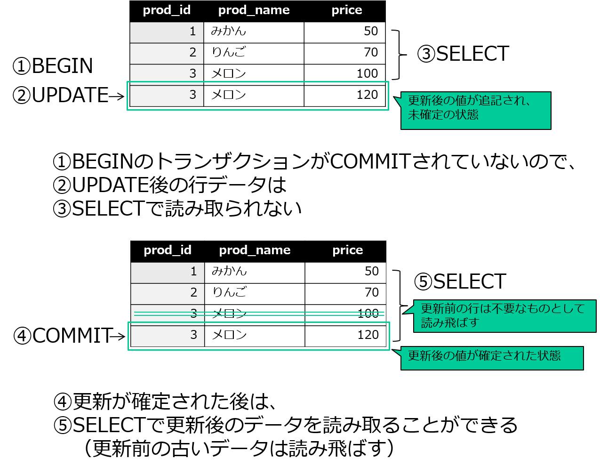
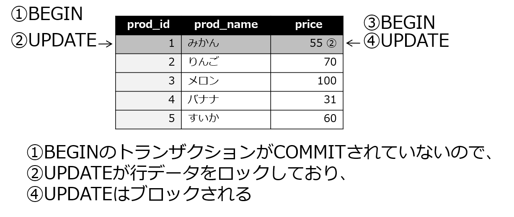
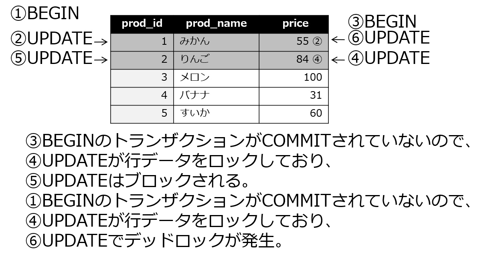

# マルチユーザーでの利用
PostgreSQLはマルチユーザーのデータベースです。複数のユーザーを使い分けることで、あるユーザーは表のデータを更新でき、あるユーザーは検索のみ行えるようにするなど、ユーザー毎に行えるデータベースの操作を変えたりすることができます。この章ではマルチユーザーによるデータベースの利用について解説します。

## ユーザーの作成
PostgreSQLのユーザーを作成するには、CREATE USER文を使用します。また、Linuxのコマンドラインからcreateuserコマンドを使用してもユーザーを作成できます。

ユーザーを確認するには\\duメタコマンドを実行します。

以下の例では、ユーザーsatoを作成しています。このユーザーでログインするときに必要なパスワードも指定しています。

```
ossdb=# CREATE USER sato PASSWORD 'sato';
CREATE ROLE
ossdb=# \du
                                            ロール一覧
 ロール名 |                                   属性                                   | 所属グループ
----------+--------------------------------------------------------------------- -----+--------------
 postgres | スーパユーザ, ロール作成可, DB作成可, レプリケーション可, RLS のバイパス | {}
 sato     |                                                                          | {}
```

以下の例では、Linuxのコマンドラインから、createuserコマンドを使用してユーザーsuzukiを作成しています。-Pオプションをつけると、このユーザーでログインするときに必要なパスワードを対話式で指定することができます。

```
[postgres@host1 ~]$ createuser -P suzuki
新しいロールのためのパスワード:
もう一度入力してください：
[postgres@host1 ~]$ psql ossdb
ossdb=# \du
                                             ロール一覧
 ロール名 |                                   属性                                   | 所属グループ
----------+--------------------------------------------------------------------- -----+--------------
 postgres | スーパユーザ, ロール作成可, DB作成可, レプリケーション可, RLS のバイパス | {}
 sato     |                                                                          | {}
 suzuki   |                                                                          | {}
```

### ユーザーとロール
CREATE USER文やcreateuserコマンドの結果表示にはユーザーではなくロール(ROLE)と表示されています。PostgreSQLではログイン属性を持つロールをユーザーと呼びます。理想的なアクセス制御は、権限の集合としてのロール（グループロール）と、ログイン可能な属性を持つロール（ユーザーロール）を適切に使い分けることで実現します。

例えば、あるサービスを運用するために必要な複数の表に対するアクセス権限（A表に対する更新可能、B表に対しては参照のみ可能のような細やかな設定）をまとめたグループロールを作成し、そのグループロールを特定の管理ユーザーに付与するようにします。ユーザーの棚卸やサービスの変更（テーブル構成の見直し）などがあった場合に柔軟に対処するためです。

本書では、単にデータベースに接続しSQLの基礎を学習するという目的に沿って、ログイン時に使用するユーザーという概念を重視し、ユーザーの作成として解説しています。

### スーパーユーザー
データベースには一番最初に初期化した際に、データベースに対するすべての権限を持ったユーザーが作成されます。これをスーパーユーザーと呼びます。Linuxにおけるrootユーザーや、WindowsにおけるAdministratorユーザーのようなものと考えればよいでしょう。

PostgreSQLでは、Linux上でデータベースの初期化（initdbコマンドの実行）を行ったOSユーザーの名前でスーパーユーザーが作成されます。このユーザーのユーザ名は慣習的にpostgresとなっています。

## 接続と認証
マルチユーザーで利用する際には、外部からネットワーク経由でのPostgreSQLへの接続や、接続時の認証が必要となります。これらはデフォルトでは設定されていないので、設定方法について解説します。

### 接続認証の設定を確認
PostgreSQLでの接続認証の設定は、設定ファイルの一つであるpg_hba.confに記述します。デフォルトでは、以下のように設定が記述されています。

```
[postgres@host1 ~]$ cat /var/lib/pgsql/data/pg_hba.conf
（略）
# TYPE  DATABASE        USER            ADDRESS                 METHOD

# "local" is for Unix domain socket connections only
local   all             all                                     peer
# IPv4 local connections:
host    all             all             127.0.0.1/32            ident
# IPv6 local connections:
host    all             all             ::1/128                 ident
（略）
```

各項目の設定は、左から順に以下のようになっています。

- 接続方法（TYPE）
クライアントがどのようにPostgreSQLに接続するかを指定します。

| 接続タイプ | 説明
|---|---
| local | PostgreSQLが実行されているホストと同じホストからの接続
| host | 外部からのTCP/IPを使った接続
| hostssl | 外部からのSSLを使った接続

- データベース（DATABASE）
接続認証の対象となるデータベースを指定します。allと記述するとすべてのデータベースが対象となります。

- ユーザー（USER）
接続認証の対象となるユーザーを指定します。allと記述するとすべてのユーザーが対象となります。

- クライアントのアドレス（ADDRESS）
接続を許可するクライアントのアドレスを指定します。指定しないとすべてのクライアントが対象となります。

- 認証方法（METHOD）  
認証方式を指定します。

| 認証メソッド | 説明
|---|---
| trust | 認証なしに接続
| reject | 接続拒否
| scram-sha-256 | SCRAM認証
| md5 | MD5パスワード認証
| password | 平文パスワード認証
| gss | GSSAPI認証
| sspi | SSPI
| ident | IDENT認証
| peer | Peer認証
| ldap | LDAP認証
| radius | RADIUS認証
| cert | SSLクライアント証明書認証
| pam | PAM認証
| bsd | BSD認証

実習環境の設定では、ローカルホストでの接続（local）で、すべてのデータベース、ユーザーに対してPeer認証を行うことが設定されています。Peer認証は、OSのユーザー名とデータベースのユーザー名が一致していることを確認する認証です。

### 接続ユーザーの指定
psqlでデータベースに接続する際、本来はどのユーザーで接続するか指定する必要がありますが、明示的に指定されなかった場合にはpsqlを実行したLinuxのユーザー名が暗黙の内に指定されます。

接続ユーザーは\\setメタコマンドを実行して変数USERの値で確認できます。

以下の例では、idコマンドの結果でLinuxのユーザー名がpostgresであること、接続のユーザーもpostgresになっていることを確認しています。psqlにはデータベース名としてossdbのみ指定しているので、接続ユーザーは暗黙の内にコマンドを実行したOSユーザーpostgresが指定されているのが分かります。

```
[postgres@host1 ~]$ id
uid=1001(postgres) gid=1001(postgres) groups=1001(postgres) context=unconfined_u:unconfined_r:unconfined_t:s0-s0:c0.c1023
[postgres@ host1 ~]$ psql ossdb
psql (13.14)
"help"でヘルプを表示します。

ossdb=# \set
※不要な設定値は削除しています
DBNAME = 'ossdb'
USER = 'postgres'
```

次に、ユーザーsatoで接続した場合の例です。接続で使用するユーザー名はpsqlの2番目の引数として指定します。Peer認証なので、接続に失敗します。

```
[postgres@host1 ~]$ psql ossdb sato
psql: エラー: FATAL:  ユーザ"sato"で対向(peer)認証に失敗しました
```

## パスワード認証の設定
ユーザー名を変えてデータベースに接続できるよう、パスワード認証の設定を行ってみましょう。

### ユーザーのパスワードの設定
パスワード認証が有効になると、パスワードが設定されていないユーザーはデータベースに接続できなくなるので、まず先にユーザーのパスワードを設定しておきます。

既存のユーザーに対してはALTER USER文でパスワードを設定します。初期ユーザーであるpostgresユーザーにはパスワードが設定されていませんので、通常はインストール直後に必ず本操作を実施しましょう。

ALTER USER文でパスワードを設定する構文は以下の通りです。

```
ALTER USER ユーザー名 PASSWORD 'パスワード'
```

以下の例では、ユーザーpostgresに対してパスワードをpostgresに設定しています。

```
ossdb=# ALTER USER postgres PASSWORD 'postgres';
ALTER ROLE
```

### パスワード認証の設定
データベースへの接続時にパスワード認証を行うように設定してみます。パスワード認証を設定するにはpg_hba.confの設定で認証方式をpeerからmd5に変更します。設定の変更はOSユーザーをpostgresにして行います。

```
[postgres@host1 ~]$ vi /var/lib/pgsql/data/pg_hba.conf
（省略）
# TYPE  DATABASE        USER            ADDRESS                 METHOD

# "local" is for Unix domain socket connections only
local   all             all                                     md5 ←peerから変更
# IPv4 local connections:
host    all             all             127.0.0.1/32            md5 ←peerから変更
# IPv6 local connections:
host    all             all             ::1/128                 md5 ←peerから変更
```

設定の変更はPostgreSQLを再起動（または設定の再読み込み）をするまでは有効になりません。パスワードの設定を行わないまま本設定を読み込むと、Peer認証が無効になってしまうためデータベースに接続できなくなりますので注意してください。

### 設定値の再読み込み
PostgreSQLの各設定には、その設定が反映されるタイミングが定められています。ほぼすべてのパラメーターが起動時に読み込まれるほか、pg_hba.confの設定やその他の一部のパラメーターは設定の再読み込みで反映されるようになっています。

以下の例は、OSの管理ユーザーadminで、systemctlコマンドでPostgreSQLの設定を再読み込みしています。OSのユーザーがpostgresではない点に注意してください。

```
[admin@host1 ~]$ sudo systemctl reload postgresql
```

PostgreSQLの停止または再起動は、他のユーザーがデータベースを使用している場合、デフォルトでは実行中の処理を中断して停止処理が優先される動作になっています。重要な処理の実行に影響しないよう、メンテナンス時間帯を設けて作業を行うことが大切ですが、設定の再読み込みのように他の処理への影響を軽微にできる方法が用意されている場合もあります。

### パスワード認証による接続
パスワード認証が有効になったかどうかを確認します。

以下の例では、ユーザーpostgresでの接続を確認しています。

```
[postgres@host1 ~]$ psql ossdb
ユーザ postgres のパスワード: ※postgresと入力
psql (13.14)
"help"でヘルプを表示します。

ossdb=#
```

### その他のユーザー
その他のユーザーにもパスワードを設定して接続できるようにします。

以下の例では、ユーザーsatoにパスワードを設定して、接続ユーザーをsatoに切り替えています。

```
ossdb=# ALTER USER sato PASSWORD 'postgres';
ALTER ROLE
ossdb=# \q
[postgres@host1 ~]$ psql ossdb sato
ユーザ sato のパスワード: ※postgresと入力
psql (13.14)
"help"でヘルプを表示します。

ossdb=>
```

psqlのプロンプトが「=#」ではなく「=>」になっており、これはユーザーsatoが、スーパーユーザーでなく一般ユーザーであることを表します。

## ネットワーク経由接続
PostgreSQLは、TCP/IPを利用したネットワーク経由での接続も受け付けることができます。

ネットワーク経由接続を受け付けるには、postgresql.confにlisten_addressesの設定を行って、PostgreSQLを再起動します。

デフォルトではlisten_addresses = 'localhost'が設定されていて、PostgreSQLが実行されているホストでのローカルループバック接続のみが有効になっています。値を*（アスタリスク）に設定することで、ホストが用意しているすべてのインターフェースからの接続を受け付けるようになります。もし特定のインターフェースからのみ受け付けたい場合には、そのインターフェースに設定されたIPアドレスを記述します。

接続受付のポート番号はデフォルトで5432に設定されています。ポート番号を変更したい場合には、portの設定値を変更します。

以下の例では、すべてのインターフェースからの接続を受け付けるように設定しています。
```
[postgres@host1 ~]$ vi /var/lib/pgsql/data/postgresql.conf
（略）
#listen_addresses = 'localhost'         # what IP address(es) to listen on;
listen_addresses = '*'          # what IP address(es) to listen on;
                                        # comma-separated list of addresses;
                                        # defaults to 'localhost'; use '*' for all
                                        # (change requires restart)
#port = 5432                            # (change requires restart)
（略）
```

あわせて、接続認証の設定も行います。pg_hba.confのhostアクセス制御を設定します。

以下の例では、ネットワーク経由接続でローカルループバックアドレス（127.0.0.1/32・::1/128）からのアクセスする際にパスワード認証するように設定しています。pg_hba.confの設定反映は再読み込みで良いですが、今回はpostgresql.confも変更していますので、PostgreSQLの再起動で設定を反映させる必要があります。
```
[postgres@host1 ~]$ vi /var/lib/pgsql/data/pg_hba.conf
（略）
# TYPE  DATABASE        USER            ADDRESS                 METHOD

# "local" is for Unix domain socket connections only
local   all             all                                     md5
# IPv4 local connections:
host    all             all             127.0.0.1/32            md5
# IPv6 local connections:
host    all             all             ::1/128                 md5
（略）
```

### PostgreSQLの再起動
設定変更後に設定を反映させるためPostgreSQLを再起動します。

以下の例は、OSの管理ユーザーadminで、systemctlコマンドでPostgreSQLの設定を再起動しています。OSのユーザーがpostgresではない点に注意してください。

```
[admin@host1 ~]$ sudo systemctl restart postgresql
```

### psqlを使ったネットワーク経由接続
psqlを使ってPostgreSQLにネットワーク経由接続するにはオプション-hでホスト名、-pでポート番号を指定します。ユーザー、データベース、クライアント端末の組み合わせがpg_hba.confで許可されている必要があります。

```
psql -h ホスト名 -p ポート番号 -U ユーザー名 データベース名
```

以下の例では、サーバーのローカルループバックアドレス（127.0.0.1）に対してネットワーク経由接続を行っています。これまでのローカル接続（UNIXドメインソケット接続）と、ローカルループバックアドレス（TCP/IP接続）は接続経路が異なります。

```
[postgres@host1 ~]$ psql -h localhost -p 5432 -U postgres ossdb
ユーザ postgres のパスワード: ※postgresと入力
psql (13.14)
"help"でヘルプを表示します。

ossdb=#
```

## アクセス権限
1つのデータベースに複数のユーザーが接続できる場合、アクセス権限を設定することで表などに対する操作を制御することができます。

### アクセス権限の付与
アクセス権限を付与するには、GRANT文を使用します。

GRANT文の構文は以下の通りです。

```
GRANT {ALL | SELECT | INSERT | DELETE | UPDATE}
	ON object TO {user | PUBLIC}
```

以下の例は、ユーザーsatoに対してprod表に対するすべての権限を付与しています。prod表の所有者（owner）であるpostgresユーザーで操作して、ユーザーsatoに対して権限を与えます。

```
ossdb=# \dt prod
           リレーション一覧
 スキーマ | 名前 |  タイプ  |  所有者
----------+------+----------+----------
 public   | prod | テーブル | postgres
(1 行)

ossdb=# GRANT all ON prod TO sato;
GRANT
```

### アクセス権限の確認
アクセス権限を確認するには、\\dpメタコマンドを使用します。
```
ossdb=# \dp prod
                                 アクセス権限
 スキーマ | 名前 |  タイプ  |       アクセス権限        | 列の権限 | ポリシー
----------+------+----------+---------------------------+----------+----------
 public   | prod | テーブル | postgres=arwdDxt/postgres+|          |
          |      |          | sato=arwdDxt/postgres     |          |
(1 行)
```

アクセス権の表記は以下の通りです。

```
権限を付与されたユーザー=権限種別/権限を付与したユーザー
```

権限を付与されたユーザーが空白のときはpublic（全ユーザー）に対して許可されていることを表します。
アクセス権限の後ろにある「/postgres」は、この権限を与えたユーザーを表しています。表のオーナーや、相当する操作が許可されたユーザーが当てはまります。

権限種別 | 説明
---- | -------
a	| INSERT(Appendの意)
r	| SELECT(Readの意)
w	| UPDATE(Writeの意)
d	| DELETE
D	| TRUNCATE
x	| REFERENCES
t	| TRIGGER

REFERENCES権限は、外部キー制約を作成する両方の表に権限を持っている必要があります。

TRIGGER権限は、表に対する操作をトリガー（引き金）にして別の処理を行う「トリガー機能」を表に対して作成できる権限です。

### アクセス権限の取り消し
与えたアクセス権限を取り消すには、REVOKE文を使用します。

REVOKE文の構文は以下の通りです。

```
REVOKE {ALL | SELECT | INSERT | DELETE | UPDATE}
	ON object FROM {user|PUBLIC}
```

以下の例では、ユーザーsatoからprod表に対するすべての権限を取り消しています。
```
ossdb=# REVOKE all ON prod FROM sato;
REVOKE
ossdb=# \dp prod
                                 アクセス権限
 スキーマ | 名前 |  タイプ  |       アクセス権限        | 列の権限 | ポリシー
----------+------+----------+---------------------------+----------+----------
 public   | prod | テーブル | postgres=arwdDxt/postgres |          |
(1 行)
```

## トランザクション
トランザクションとは、データベースに対する1つ以上の処理のまとまりのことです。データベースに対する処理が開始されると同時にトランザクションが開始(BEGIN)され、まとまった処理の結果を確定するコミット(COMMIT)、あるいは処理を破棄するロールバック(ROLLBACK)が行われるまでが1つのトランザクションです。

これまでPostgreSQLの操作に使用してきたSQL文は、自動コミット（AUTOCOMMIT）がデフォルトで有効になっていたため、すべての操作が成功すると自動的にCOMMITが発行されていました。自動コミットを無効にするには、psqlメタコマンドの\\set AUTOCOMMIT=offを実行するか、BEGINを実行して明示的にトランザクションを開始する必要があります。

以下の例では、customer表に1行INSERTしますが、それをBEGINで開始することでトランザクションとして実行しています。最後にROLLBACKしてINSERTが取り消されている例と、最後にCOMMITして挿入した結果が確定されている例です。

```
ossdb=# BEGIN;
BEGIN
ossdb=# INSERT INTO customer VALUES (5,'田中産業');
INSERT 0 1
ossdb=# SELECT * FROM customer WHERE customer_id = 5;
 customer_id | customer_name
-------------+---------------
           5 | 田中産業
(1 行)

ossdb=# ROLLBACK;
ROLLBACK
ossdb=# SELECT * FROM customer WHERE customer_id = 5;
 customer_id | customer_name
-------------+---------------
(0 行)
```

トランザクションがROLLBACKされて、INSERTが取り消されているのが確認できました。

以下の例ではトランザクションをCOMMITします。

```
ossdb=# BEGIN;
BEGIN
ossdb=# INSERT INTO customer VALUES (5,'田中産業');
INSERT 0 1
ossdb=# COMMIT;
COMMIT
ossdb=# SELECT * FROM customer WHERE customer_id = 5;
 customer_id | customer_name
-------------+---------------
           5 | 田中産業
(1 行)
```

トランザクションがCOMMITされて、INSERTが確定しました。

### 読み取り一貫性
読み取り一貫性とは、あるトランザクション内で行われているデータ更新はコミットして確定されない限り、他の検索トランザクションに対して影響を及ぼさないことです。

以下の例では、まず1つのデータベース接続でトランザクションを開始します。メロンの価格を120円にアップデートしました。まだCOMMITもROLLBACKもせず、トランザクションの途中で他のセッションからprod表を検索すると元の100円が得られます。更新トランザクションが確定された後は他のセッションでも更新後の120円を得ることができます。
```
ossdb=# SELECT * FROM prod WHERE prod_id = 3;
 prod_id | prod_name | price
---------+-----------+-------
       3 | メロン    |   100
(1 行)

ossdb=# BEGIN;
BEGIN
ossdb=# UPDATE prod SET price = 120 WHERE prod_id = 3;
UPDATE 1
ossdb=# SELECT * FROM prod WHERE prod_id = 3;
 prod_id | prod_name | price
---------+-----------+-------
       3 | メロン    |   120
(1 行)
```

COMMITしていない状態で、別のターミナルを起動してデータベースに接続し、検索を行ってみます。

```
[postgres@host1 ~]$ psql ossdb
ユーザ postgres のパスワード:
psql (13.14)
"help"でヘルプを表示します。

ossdb=# SELECT * FROM prod WHERE prod_id = 3;
 prod_id | prod_name | price
---------+-----------+-------
       3 | メロン    |   100
(1 行)
```

COMMIT前の行データが検索されます。

トランザクションを実行していたターミナルに戻り、トランザクションを確定させます。

```
ossdb=# COMMIT;
COMMIT
```

再度、新しい方のターミナルに戻り、検索を行ってみます。

```
※以下は前の実行結果
ossdb=# SELECT * FROM prod WHERE prod_id = 3;
 prod_id | prod_name | price
---------+-----------+-------
       3 | メロン    |   100
(1 行)
※以下は別ターミナルでCOMMITされた後の実行結果
ossdb=# SELECT * FROM prod WHERE prod_id = 3;
 prod_id | prod_name | price
---------+-----------+-------
       3 | メロン    |   120
(1 行)
```



\pagebreak

このように、最初のトランザクションが行データを追加していても、そのトランザクションがコミットされる前では、別のトランザクションからはその行データ追加は見えません。もし見えてしまうと、その後ロールバックされて追加が取り消された時、結局存在しないことになった行データを読んでしまうことになるからです。このようにコミットされる前の行データを読んでしまうことを「ダーティーリード」と呼びます。

PostgreSQLはダーティーリードが発生しないよう、読み取り一貫性を維持しています。なお、本項では詳しく扱いませんが、図中にあるように、PostgreSQLでは更新が確定された後、古い行を読み飛ばす制御も行っています。

### ロック機構と更新の競合
データベースは、先に行われたトランザクションの対象をロックし、他のトランザクションが書き換えないように保護します。ロックされているデータ行を他のトランザクションが更新しようとすると更新の競合が発生し、コミットまたはロールバックでロックが解除されるまで処理が待たされます。

以下の例では、まず一つのトランザクションがprod表の行データを更新します。

```
ossdb=# BEGIN;
BEGIN
ossdb=# UPDATE prod SET price = price * 1.1 WHERE prod_id = 1;
UPDATE 1
ossdb=# SELECT * FROM prod WHERE prod_id =1;
 prod_id | prod_name | price
---------+-----------+-------
       1 | みかん    |    55
(1 行)
```

別のターミナルでprod表の同じ行データを更新します。

```
ossdb=# SELECT * FROM prod WHERE prod_id =1;
 prod_id | prod_name | price
---------+-----------+-------
       1 | みかん    |    50
(1 行)

ossdb=# BEGIN;
BEGIN
ossdb=# UPDATE prod SET price = price * 1.2 WHERE prod_id = 1;
※結果が返らず、制御も戻りません
```


2つめのUPDATE文が実行されたところで更新の競合が発生し、前のトランザクションが完了するまで待たされます。

以下のように、前のトランザクションをコミットかロールバックするとロックが解除され、後から実行されたUPDATE文の更新が完了します。

```
※以下は前の実行結果
ossdb=# BEGIN;
BEGIN
ossdb=# UPDATE prod SET price = price * 1.1 WHERE prod_id = 1;
UPDATE 1
ossdb=# SELECT * FROM prod WHERE prod_id =1;
 prod_id | prod_name | price
---------+-----------+-------
       1 | みかん    |    55
(1 row)
※以下でROLLBACKを実行
ossdb=# ROLLBACK;
ROLLBACK
```

前のトランザクションがロールバックされると、後から実行されたUPDATE文の更新が完了することを確認します。

```
※以下は前の実行結果
ossdb=# BEGIN;
BEGIN
ossdb=# UPDATE prod SET price = price * 1.2 WHERE prod_id = 1;
※結果が返らず、制御も戻らない状態
※別ターミナルでROLLBACKが実行されるとUPDATEが完了する
UPDATE 1
ossdb=*# SELECT * FROM prod WHERE prod_id =1;
 prod_id | prod_name | price
---------+-----------+-------
       1 | みかん    |    60
(1 行)

ossdb=# COMMIT;
COMMIT
```

後から実行されたUPDATE文の実行時のprice列の値は50だったため、1.2倍の60に更新されています。

### デッドロック
もし、2つのトランザクションがお互いに相手のロックしているデータ行を更新しようとして、更新の競合が同時に発生したらどうなるでしょうか。トランザクションが互いに相手のロック解除待ちで止まってしまう状態になることを「デッドロック」と呼びます。

PostgreSQLではデッドロックが発生すると、どちらかのトランザクション全体を失敗させて強制的にロールバックさせます。片方のトランザクションが行っていたロックは解除されるので、もう一方のトランザクションは正常に終了することができます。

以下の例では、2つのトランザクションでデッドロックを発生させています。

まず、一方のトランザクションがprice表のprod_id列の値が1の行データを更新します。

```
ossdb=# BEGIN;
BEGIN
ossdb=# UPDATE prod SET price = price * 1.1 WHERE prod_id = 1;
UPDATE 1
```

次に、別のターミナルで実行したトランザクションがprice表のprod_id列の値が2の行データを更新します。
```
ossdb=# BEGIN;
BEGIN
ossdb=# UPDATE prod SET price = price * 1.1 WHERE prod_id = 2;
UPDATE 1
```

さらに、前のトランザクションがprice表のprod_id列の値が2の行データを更新します。この更新はもう一方のトランザクションが更新してロックしている行データなので、更新の競合が発生します。

```
※以下は前の実行結果
ossdb=# BEGIN;
BEGIN
ossdb=# UPDATE prod SET price = price * 1.1 WHERE prod_id = 1;
UPDATE 1
※更新の競合が発生するUPDATEを実行
ossdb=# UPDATE prod SET price = price * 1.2 WHERE prod_id = 2;
※結果が返らず、制御も戻りません
```

もう一方のトランザクションが、前のトランザクションが更新しているprice表のprod_id列の値が1の行データを更新しようとすると、デッドロックが発生し、トランザクションはロールバックされます。この結果、前のトランザクションのロック待ちが解除され、更新が実行されます。

```
※以下は前の実行結果
ossdb=# BEGIN;
BEGIN
ossdb=# UPDATE prod SET price = price * 1.1 WHERE prod_id = 2;
UPDATE 1
※デッドロックが発生するUPDATEを実行
ossdb=# UPDATE prod SET price = price * 1.2 WHERE prod_id = 1;
ERROR:  デッドロックを検出しました
DETAIL:  プロセス 43233 は ShareLock を トランザクション 599 で待機していましたが、プロセス 43040 でブロックされました
プロセス 43040 は ShareLock を トランザクション 600 で待機していましたが、プロセス 43233 でブロックされました
HINT:  問い合わせの詳細はサーバログを参照してください
CONTEXT:  リレーション"prod"のタプル(0,8)の更新中
```

デッドロックを検出し、トランザクションが強制的にロールバックされると、更新の競合が発生していたUPDATEは実行されます。

```
ossdb=# BEGIN;
BEGIN
ossdb=*# UPDATE prod SET price = price * 1.1 WHERE prod_id = 1;
UPDATE 1
ossdb=*# UPDATE prod SET price = price * 1.2 WHERE prod_id = 2;
UPDATE 1
```



\pagebreak

デッドロックが発生しないようにする、または影響を軽微に抑えるいくつかの方法が論じられますが、完全に防ぐことは難しいとも言われる話題です。

ひとつの有力な案としては、複数個所の更新が必要な場合に更新の順序を一定にすることです。例のように更新対象行を交差させてしまうとデッドロックが発生しやすくなります。上記では「prod_idが小さいほうから更新する」ようなルールを定めておけば、後からのトランザクションはひとつ目の更新を待機しますのでデッドロックは発生しません。

そしてトランザクションがデータ行をロックしている時間を短くするために、できるだけ早くトランザクションを終了することです。トランザクションの時間を短くすればするほど、デッドロックが発生しにくくなります。

ただし、アプリケーションによっては「prod_idが小さいほう」を決めることが容易でない場合や、大規模な開発では規約が守られないケースもあるでしょう。上記は同一テーブル内の複数行ですが、複数テーブル間で発生するデッドロックや、索引や制約に起因するユーザーが意図せず発生してしまうデッドロックもあります。

\pagebreak
